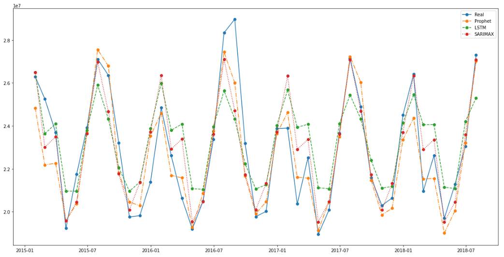
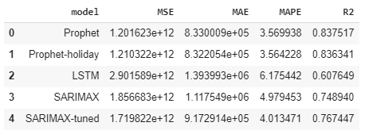

# forecast-energy-consumption
Forecasting energy consumption can be crucial to have a sense of how much energy/power needs to be produced. The objective of this work is to predict future monthly energy consumption from time-series data. The data includes hourly energy consumption of different states in the US collected by a regional transmission organization - PJM. Different exploratory data analysis are performed on the data to detect the daily, weekly, monthly, and yearly trends. To predict future energy consumption, several models (ARIMA, PROPHET, LSTM) are trained on the time series data. Finally, the performance of different models is compared to predict monthly energy consumption. 

The following models are trained:

• PROPHET with & without holidays. (R2: 0.84, MAPE: 3.5%)  
• Seasonal ARIMA - SARIMAX. (R2: 0.77, MAPE: 4%)  
• LSTM. (R2: 0.60, MAPE: 6.2%) 

# How to run:
Please check the Forecast energy consumption.ipynb file for the detailed analysis. Check the PJME_hourly.csv file for the data.
